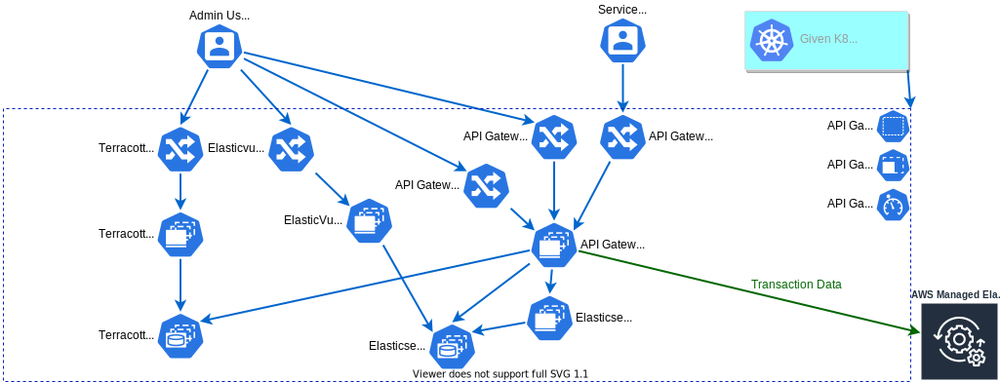

# WebMethods API Gateway Solution 01 Helm Chart

- [WebMethods API Gateway Solution 01 Helm Chart](#webmethods-api-gateway-solution-01-helm-chart)
  - [Description](#description)
  - [Custom Prefix](#custom-prefix)

## Description

"Solution 01" separates the components of API Gateway in dedicated deployments as in the following diagram:



## Custom Prefix

As specified in the [provided examples](https://github.com/SoftwareAG/webmethods-api-gateway/tree/master/samples/kubernetes/helm/cluster-deployment/apigateway#custom-prefix), a custom prefix may be used to differentiate various deployments of the same helm chart.

> If desired a custom prefix can be specified which will be applied to the names of deployments, statefulsets,
> replica sets, pods, services, config maps, and ingresses.
>
> Specify the custom prefix like this:
>
> ```yaml
> # my-values.yaml
> global:
>   customPrefix:     "myprefix"
> ```
>
> Names will then look like this:
>
> ```bat
> C:\>kubectl get pods
> NAME                                  READY   STATUS    RESTARTS   AGE
> myprefix-apigw-105-564f98cdcb-5wmwt   1/1     Running   0          20m
> myprefix-apigw-105-564f98cdcb-9pf77   1/1     Running   0          20m
> myprefix-apigw-105-564f98cdcb-w6684   1/1     Running   0          20m
> myprefix-elasticsearch-ss-0           1/1     Running   0          20m
> myprefix-elasticsearch-ss-1           1/1     Running   0          19m
> myprefix-elasticsearch-ss-2           1/1     Running   0          19m
> myprefix-kibana-ss-0                  1/1     Running   0          20m
> myprefix-terracotta-ss-0              1/1     Running   0          20m
> myprefix-terracotta-ss-1              1/1     Running   0          19m
> ```


______________________
These tools are provided as-is and without warranty or support. They do not constitute part of the Software AG product suite. Users are free to use, fork and modify them, subject to the license agreement. While Software AG welcomes contributions, we cannot guarantee to include every contribution in the master project.	
